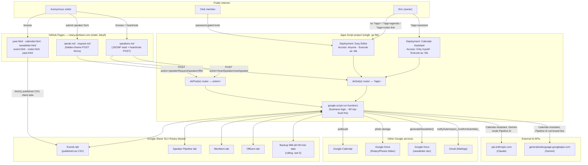
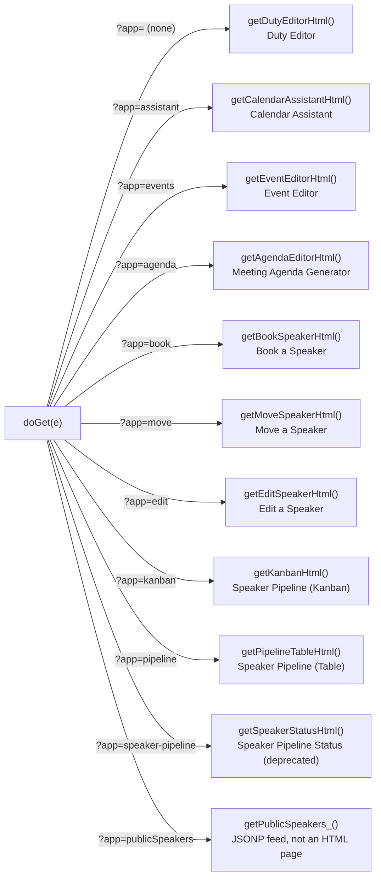

# APPSCRIPT.md — RotaryCalendarSync.gs Architecture

Deep-dive reference for `appscript/RotaryCalendarSync.gs` — one file, one Apps
Script project, bound to the SLV Rotary "Events" Google Sheet. For sheet
column layouts, event types, and per-feature product behavior, see
[CLAUDE.md](CLAUDE.md); this file is about **how the code is wired together**:
process architecture, the APIs it exposes, and how auth actually works.

---

## 1. System architecture

**The load-bearing fact:** there is exactly **one** Apps Script project. It is
deployed **twice** (two separate `/exec` URLs, two separate access-control
settings), but both deployments run the *same* `doGet`/`doPost` and can call
*any* function in the project. The two deployments differ only in who's
allowed to load them — see [§4 Auth model](#4-auth-model).

---

## 2. Deployments

| Deployment | Access | Execute as | URL | Serves |
|---|---|---|---|---|
| **Duty Editor** | Anyone (with the link) | Me (Eric) | `.../exec` | `doGet` routed by `?app=` — this is the deployment nearly every tool in this document actually runs under |
| **Calendar Assistant** | Only myself (Eric) | Me (Eric) | `.../exec?app=assistant` | `getCalendarAssistantHtml()` only |

"Execute as: Me" means every `SpreadsheetApp` / `CalendarApp` / `DriveApp` /
`MailApp` call runs with **Eric's** Google permissions no matter who loaded
the page — a visitor never needs (or gets) their own Google access to the
underlying Sheet, Calendar, or Drive folder. This is what makes the "Anyone"
deployment possible at all: the web app is the only thing touching Google
data directly; the public GitHub Pages site never does.

The Duty Editor deployment URL is stored once, in `_config.yml` as
`apps_script_url`, and every static page that needs it (`duty.md`,
`speak.md`, `request.md`, `speakers.md`, the tool cards on `calendar.html`
and `pipeline.md`) reads it from there via Liquid. After editing the `.gs`,
**Deploy → Manage deployments → (pick one) → New version** — the two
deployments are versioned independently, and only agents/pages hitting the
redeployed one see the change.

---

## 3. Apps exported (`doGet` routing)

| `?app=` value | HTML function | Password? | Purpose |
|---|---|---|---|
| *(none)* | `getDutyEditorHtml()` | **No** | Assign MC/Greeter/AV-Zoom/etc. duties for upcoming Meetings, Assemblies, Socials. |
| `assistant` | `getCalendarAssistantHtml()` | No app password — gated by deployment access ("Only myself") | AI chat that proposes calendar changes for Eric to approve. |
| `events` | `getEventEditorHtml()` | Yes (`KANBAN_PASSWORD`) | Member-facing create/edit for non-meeting events (Social, Service, Fundraiser, Committee, Message, Other). |
| `agenda` | `getAgendaEditorHtml()` | **No** | Printable 15-row meeting agenda + duty table. Read-only, so nothing to gate. |
| `book` | `getBookSpeakerHtml()` | Yes (`KANBAN_PASSWORD`) | One-step "enter a new speaker + assign to a Meeting" form; also drops a matching Speaker Pipeline card. |
| `move` | `getMoveSpeakerHtml()` | Yes (`KANBAN_PASSWORD`) | Reassign an already-booked speaker from one Meeting to another. |
| `edit` | `getEditSpeakerHtml()` | Yes (`KANBAN_PASSWORD`) | Fix up a booked speaker's fields, or clear them from a Meeting entirely. |
| `kanban` | `getKanbanHtml()` | Yes (`KANBAN_PASSWORD`) | Drag-and-drop speaker pipeline board. |
| `pipeline` | `getPipelineTableHtml()` | Yes (`KANBAN_PASSWORD`) | Sortable/filterable speaker pipeline table — the current default pipeline view. |
| `speaker-pipeline` | `getSpeakerStatusHtml()` | Yes (`KANBAN_PASSWORD`) | Older grouped-by-stage pipeline view. Deprecated in favor of `pipeline`. |
| `publicSpeakers` | `getPublicSpeakers_()` | **No** (public by design) | JSONP feed of new/in-progress/upcoming-scheduled speakers, consumed by `/speakers/` (`speakers.md`) via a `<script src>` tag. |

**Not an Apps Script route:** `roster.html` (`/roster/`, the printable duty
sign-up sheet) is a *plain static page on the GitHub Pages site*, not a
`?app=` value — it reads the published Events CSV directly, the same way
`year.html`/`calendar.html` do, and needs no Apps Script deployment at all
since it never writes anything and the duty columns are already in the CSV.

`doGet` also does two bits of plumbing worth knowing about:

- **`__EXEC_URL__` injection** — Apps Script serves pages inside a sandboxed
  iframe on a `googleusercontent.com` origin, so a plain relative link inside
  the page (e.g. `href="?app=agenda"`) resolves against that sandbox origin
  and 404s. `doGet`'s local `inject()` helper string-replaces the literal
  token `__EXEC_URL__` in the HTML with the deployment's real
  `ScriptApp.getService().getUrl()` before serving it, so cross-tool nav
  links (`target="_top"`) actually work. It's applied to `events`, `agenda`,
  `book`, `move`, `edit`, `kanban`, `pipeline`, and `speaker-pipeline` — **not**
  to the bare Duty Editor or `assistant`, which currently link to nothing else
  internally.
  Links to the plain GitHub Pages site (e.g. the Duty Editor's roster link,
  or the pipeline apps' "+ Request Speaker" link) sidestep this entirely by
  using a full external URL with `target="_blank"`, which needs no injection.
- **Viewport meta tag** — same sandboxing problem: a `<meta viewport>` tag
  written inside the served HTML is ignored by the wrapping iframe, so every
  route adds it via `.addMetaTag('viewport', …)` on the `HtmlService` output
  object itself, which does reach the real top-level page.

---

## 4. Auth model

There is no session system, no cookies, and no per-user accounts anywhere in
this project — everything is one of four mechanisms, from strongest to
weakest:

**a) Google-account gate on the deployment itself.** The Calendar Assistant
deployment's access is set to "Only myself" in the Apps Script deploy
dialog — Google enforces this before the request ever reaches `doGet`. This
is the only *real* authentication boundary in the whole system.

**b) A single shared password (`KANBAN_PASSWORD` Script Property).**
`checkPipelinePassword(password)` does a plain string comparison against one
Script Property — there's one password for the whole club, not per-member
accounts, checked via `google.script.run.checkPipelinePassword(pw)` from a
login screen. On success, the client caches the password and the typed name
in `localStorage` (`pipelinePw` / `pipelineName`) and auto-fills the login on
return visits. This gates the *client-side UI* of the Event Editor, Kanban,
Pipeline Table, and Speaker Pipeline Status pages.

**c) Server-side re-validation — inconsistently applied.** Only seven
mutating functions actually call `checkPipelinePassword()` again on the
server before writing: `saveEvent`, `deleteEvent`, and `addEventNote` (all
Event Editor writes), plus `bookSpeaker`, `moveSpeaker`, `saveSpeakerEdit`,
and `clearSpeaker` (Book/Move/Edit Speaker writes). Every Speaker Pipeline
mutation
(`savePipelineCard`, `deletePipelineCard`, `togglePipelineVote`,
`uploadPipelinePhoto`, `appendPipelineNote`, `addPipelineCard`,
`assignSpeakerToEvent`) and the plain Duty Editor's `saveDuties` take **no
password argument at all** — their only protection is the client-side login
screen in front of them (or, for the Duty Editor, no login screen
whatsoever).

**d) "Anyone with the link."** Everything else — the bare Duty Editor, the
Agenda Generator, `roster.html`, and the `publicSpeakers` JSONP feed — has no
password by design; they're either read-only or (Duty Editor) intentionally
low-friction for members.

> **Known limitation, stated plainly:** `google.script.run` exposes *every*
> top-level function in the project to *any* page loaded from the "Anyone"
> deployment — it is not scoped to only the functions a given `?app=` page's
> own HTML references. A visitor with browser devtools open on **any** page
> served by that deployment (including the un-gated Duty Editor) can call
> `google.script.run.getPipelineData()`, `getEventEditorData()`,
> `savePipelineCard(...)`, etc. directly, bypassing whichever app's own
> client-side password screen would otherwise ask for `KANBAN_PASSWORD`. The
> trailing-underscore convention on helper names (`getPipelineSheet_`,
> `assistantReadEvents_`, …) is a *style* convention signaling "internal
> helper" — Apps Script does not enforce it as a privacy boundary; nothing
> stops a client from calling those directly either, though none currently
> skip validation in a way that matters (they're pure helpers, not
> independently reachable write paths).
>
> This is consistent with this project's stated
> [prototype mindset](CLAUDE.md#constraints--conventions) — the real
> security boundary is "this URL isn't publicly promoted," the same model
> the un-gated Duty Editor already relies on. It is **not** appropriate for
> data that would be harmful if read or written by anyone who finds the
> link (e.g. speaker requestor emails/phone numbers in the Pipeline sheet
> are reachable this way today). Tightening this would mean adding a
> password argument — and a server-side check — to every Pipeline/Duty
> mutation and read, the same pattern `saveEvent`/`deleteEvent`/
> `addEventNote` already use.

**Rate limiting (a different concern — abuse, not auth):** every `doPost`
request (`speakerRequest`, `speakerOffer`, `heartSpeaker`, `noteSpeaker`) is
capped globally at `DAILY_SUBMISSION_LIMIT` (20) per calendar day via
`isRateLimited_()`, which uses a `LockService` script lock plus a
`sub_YYYY-MM-DD` counter in Script Properties (cleaned up by the
**Purge Old Rate Counters** menu item). This protects against form-spam
floods, not unauthorized access — `doPost` itself has no password check,
since `speak.md`/`request.md`/`speakers.md` are meant to be public.

**API keys never reach the client.** `ANTHROPIC_API_KEY` and
`GEMINI_API_KEY` are read from Script Properties only inside server
functions (`callAssistantApi_`, `callGeminiAssistantApi_`,
`callGeminiJson_`) and used in server-side `UrlFetchApp.fetch()` calls; the
browser never sees them.

---

## 5. HTTP-level surface (`doGet` / `doPost`)

This is the only part of the system reachable by a plain HTTP request (i.e.
curl-able, or embeddable as a `<script src>`/hidden-iframe `<form>` target
from the separate GitHub Pages origin, sidestepping CORS entirely since
these aren't `fetch()` calls). Everything else (§6) is Apps Script's own RPC
bridge and is *not* independently reachable over HTTP.

### `GET /exec` (or `/exec?app=...`)

| Query param | Meaning |
|---|---|
| `app` | Selects the route — see the table in §3. Omit for the Duty Editor. |
| `callback` | Only meaningful with `app=publicSpeakers`: the JSONP callback function name, sanitized to `[a-zA-Z0-9_]` before being echoed back verbatim in the response body. Defaults to `speakersCallback`. |

`app=publicSpeakers` is the one route that returns something other than an
HTML page: `text/javascript`, body `<callback>(<json>);` — classic JSONP,
used because the requesting page (`speakers.md`, a different origin) needs
this data with no CORS preflight and no auth.

### `POST /exec`

Body is `application/x-www-form-urlencoded` (a plain HTML `<form>` submit
target, not a `fetch()` body — see the CORS note below). Routed by the
`action` field:

| `action` | Handler | Called from |
|---|---|---|
| `speakerRequest` | `handleSpeakerRequest_(data)` | `request.md` ("Request a Speaker") |
| `speakerOffer` | `handleSpeakerOffer_(data)` | `speak.md` ("Offer to Speak") |
| `heartSpeaker` | `handleHeartSpeaker_(p)` | `speakers.md` (♡ button) |
| `noteSpeaker` | `handleNoteSpeaker_(p)` | `speakers.md` (anonymous note box) |

Every other `action` value (or a missing one) returns
`{ ok: false, error: "Unknown action: ..." }`. All four handlers return JSON
via the local `jsonOut_()` helper.

**Why a hidden iframe, not `fetch()`:** `request.md`/`speak.md`/`speakers.md`
build an invisible `<form method="POST" target="a-hidden-iframe">`, append
hidden `<input>`s for each field, and call `.submit()` — commented in the
source as a deliberate workaround: Apps Script's `/exec` URL redirects to a
`googleusercontent.com` URL, and that redirect strips CORS headers a `fetch()`
call (even `no-cors` mode) needs to complete; a real form submission just
follows the redirect like a normal browser navigation, no CORS involved.

Photo uploads on `request.md`/`speak.md` go through this same POST as a
base64 data URL field (`photoBase64`/`photoMime`/`photoName`), decoded
server-side in `savePhotoToDrive_()` and written to Drive.

---

## 6. RPC surface (`google.script.run`)

Every other function below is called only via
`google.script.run.<name>(args...).withSuccessHandler(...)`, Apps Script's
own client↔server bridge for HTML-service pages. It is **not** a REST API —
there's no independent URL per function, no way to `curl` it, and it only
works from inside a page Apps Script itself served (see §4's callout on why
that's a weaker boundary than it sounds).

Full function inventory, grouped by caller

**Duty Editor** (no password)
| Function | R/W | Purpose |
|---|---|---|
| `getPageData()` | read | Upcoming Meeting/Assembly/Social rows (next `NEWSLETTER_WEEKS_AHEAD`≈12 wks) + Members list |
| `saveDuties(rowIndex, duties)` | write | Writes the 8 duty-role columns for one row |

**Event Editor** (`?app=events`, password-checked on writes)
| Function | R/W | Purpose |
|---|---|---|
| `getEventEditorData()` | read | Non-meeting events in the next `EDITOR_WEEKS_AHEAD` (52) weeks + Members |
| `saveEvent(password, payload)` | write, **checks password** | Create/update one event row |
| `deleteEvent(password, rowIndex, editor)` | write, **checks password** | Delete a row — only if `editor` matches the row's `CREATED_BY` |
| `addEventNote(password, rowIndex, noteText, author)` | write, **checks password** | Append a timestamped note |
| `uploadPipelinePhoto(dataUrl, fileName, speakerName)` | write | Shared with the pipeline apps — saves a photo to Drive |

**Meeting Agenda Generator** (`?app=agenda`, no password — read-only)
| Function | R/W | Purpose |
|---|---|---|
| `getAgendaData()` | read | Upcoming-meeting picker list + a pre-built model for the soonest one |
| `getAgendaModel(rowIndex)` | read | Rebuilds the model when the picker selection changes |

**Book / Move / Edit Speaker** (`?app=book`\|`move`\|`edit`, password-checked on writes)
| Function | R/W | Purpose |
|---|---|---|
| `getUpcomingEventsForPicker()` | read | Shared meeting picker — same function the Speaker Pipeline's "Assign to Event" modal uses |
| `bookSpeaker(password, eventsRow, speaker, editor)` | write, **checks password** | Writes speaker/program columns onto a Meeting row, logs an Event Note, appends a `scheduled` Speaker Pipeline card |
| `moveSpeaker(password, fromRow, toRow, editor)` | write, **checks password** | Moves `SPEAKER_MOVE_COLS` from one Meeting row to another, logs an Event Note on both, repoints any linked pipeline card |
| `getSpeakerEditDetail(rowIndex)` | read | Reads a Meeting row's speaker fields + Bio/contact info from a linked pipeline card (`findLinkedPipelineRow_`, which validates the card's `SPEAKER_NAME` still matches — `EVENTS_ROW` is a row index and goes stale after a sort) |
| `saveSpeakerEdit(password, eventsRow, speaker, editor)` | write, **checks password** | Edits a booked speaker's fields on the Events row, logs an Event Note, syncs a linked pipeline card |
| `clearSpeaker(password, eventsRow, editor)` | write, **checks password** | Blanks `SPEAKER_MOVE_COLS` to unbook a speaker, logs an Event Note, unlinks + reverts a linked pipeline card to `in-progress` |
| `uploadPipelinePhoto(dataUrl, fileName, speakerName)` | write | Shared with the Event Editor and pipeline apps — saves a photo to Drive |

**Speaker Pipeline** (Kanban / Table / Status — `?app=kanban`\|`pipeline`\|`speaker-pipeline`; password gates the client UI, **not** these functions server-side)
| Function | R/W | Purpose |
|---|---|---|
| `checkPipelinePassword(password)` | — | The login check itself |
| `getPipelineData()` | read | All cards + Members + status list |
| `savePipelineCard(rowIndex, changes, updatedBy)` | write | Diff-and-write one card's fields; logs a change note |
| `deletePipelineCard(rowIndex)` | write | Hard-deletes a sheet row |
| `togglePipelineVote(rowIndex, memberName)` | write | Toggles a member's +1 in `Interested` |
| `appendPipelineNote(rowIndex, noteText, authorName)` | write | Prepends a timestamped note |
| `addPipelineCard(data, addedBy)` | write | Manually-created card |
| `getUpcomingEventsForPicker()` | read | Open/taken Meeting slots, for the "Assign to Event" modal |
| `assignSpeakerToEvent(pipelineRow, eventsRow, updatedBy)` | write | Copies speaker fields into an Events row, marks the card `scheduled` |
| `getMemberNames_()` | read | Members list (internal helper, but reachable — see §4) |
| `pipelineAssistantCommand(text, updatedBy)` | read (proposes only) | Gemini turns one instruction into proposed actions; feature-flagged off (`PIPELINE_AI_ENABLED = false`) |
| `applyPipelineActions(actions, updatedBy)` | write | Applies actions the user confirmed from the AI command line |

**Calendar Assistant** (`?app=assistant`, gated by deployment access only)
| Function | R/W | Purpose |
|---|---|---|
| `processMessage(history, provider)` | read (proposes only) | Runs the Claude- or Gemini-backed tool-use loop; queues but never writes changes |
| `applyAssistantChanges(changes)` | write | Writes queued add/update/cancel/delete changes after user confirmation |
| `createEventsBackup()` | write | Snapshots the Events tab to a `Backup MM-dd HH:mm` sheet (keeps last 5) |

**Menu-only functions** (run from the Sheets UI, not `google.script.run` — see §7) are omitted from this table.

---

## 7. External integrations & required Script Properties

| Integration | Used by | Script Property |
|---|---|---|
| Google Calendar | `pullFromCalendar()`, `pushToCalendar()` (menu) | *(none — uses `CALENDAR_ID` constant + the executing account's own Calendar access)* |
| Google Drive | Photo uploads (`savePhotoToDrive_`), `syncPhotos()`, event/speaker photos | *(none — Drive access comes from "Execute as: Me")* |
| Google Docs | `generateNewsletter()` (menu) | *(none)* |
| Gmail (`MailApp`) | `notifySubmission_()`, `confirmSubmitter_()`, `authorizeMailScope()` (menu) | `NOTIFY_EMAILS` — comma/whitespace-separated recipient list; a no-op if unset |
| Shared pipeline password | `checkPipelinePassword()` | `KANBAN_PASSWORD` |
| Anthropic (Claude) | Calendar Assistant, when `provider==='claude'` | `ANTHROPIC_API_KEY` |
| Google Gemini | Calendar Assistant default provider; Pipeline AI command line | `GEMINI_API_KEY` |

Set these under **Apps Script → Project Settings → Script Properties**.
None of them are committed to this repo.

---

## 8. Data stores

| Sheet tab | Constant | Columns | Notes |
|---|---|---|---|
| Events | `SHEET_NAME` ("Events") | `NUM_COLS` = 35 | The one published-as-CSV tab; full column-by-column reference in [CLAUDE.md](CLAUDE.md#google-sheet). |
| Speaker Pipeline | `PIPELINE_SHEET` | `NUM_PIPE_COLS` = 39 | Not published; only reachable via the RPC surface in §6. |
| Members | *(hardcoded `"Members"`)* | 1 col (Name) | Feeds every member-name `<datalist>`/dropdown across all apps. |
| Officers | `OFFICERS_SHEET` ("Officers") | Role \| Name | Hand-edited once a year; feeds the Agenda Generator only. |
| `Backup MM-dd HH:mm` | *(dynamic name)* | mirrors Events | Created by `createEventsBackup()`; rolling window of 5, oldest deleted first. |

---

## 9. Menu-triggered & trigger-driven functions

These run from the Google Sheets UI (**🔄 Rotary Sync** menu, added by
`onOpen()`) or from an installable trigger — never from `doGet`/`doPost`/RPC.

| Menu item | Function | Notes |
|---|---|---|
| Pull from Calendar → Sheet | `pullFromCalendar()` | Google Calendar → Sheet, by `Event ID` |
| Push Sheet → Calendar | `pushToCalendar()` | Sheet → Google Calendar; skips Holiday/Message rows; hash-skips unchanged rows |
| Generate Newsletter Doc | `generateNewsletter()` | Builds the Google Doc bulletin |
| Sync Photos → URL Columns | `syncPhotos()` | Extracts embedded/`=IMAGE()` photo URLs to hidden companion columns |
| Open Duty Editor (web app) | `openDutyEditor()` | Opens the deployed URL in a new tab |
| Open Speaker Pipeline (web app) | `openSpeakerPipeline()` | Opens `?app=speaker-pipeline` in a new tab |
| Setup Members Tab | `setupMembers()` | Creates/resets the Members tab |
| Setup / Reset Sheet Headers | `setupSheet()` | Widens the grid, (re)writes headers/validation — run after pasting a `.gs` with new columns |
| Setup Speaker Pipeline Tab | `setupSpeakerPipeline()` | Creates/resets the Speaker Pipeline tab |
| Migrate Confirmed → In Progress | `migratePipelineConfirmedStatus()` | One-time cleanup for a renamed pipeline status |
| Purge Old Rate Counters | `purgeOldRateCounters()` | Deletes stale `sub_YYYY-MM-DD` Script Properties from `isRateLimited_()` |
| Authorize Email (run once) | `authorizeMailScope()` | Forces the Gmail-send consent prompt |
| Install Edit Trigger (run once) | `installEditTrigger()` | Installs the `onEditInstallable` trigger below |

**Installable trigger:** `onEditInstallable(e)` fires on any edit to the
Events sheet; if the edited column is Date, Event Type, or Cancelled, it
calls `recolorRow()` to re-apply that row's text color/background/day-cell
styling. A *simple* `onEdit(e)` trigger can't reliably set formatting, hence
the installable version, set up once via the menu.

---

## See also

- [CLAUDE.md](CLAUDE.md) — product behavior, sheet column layouts, event
  types, and per-feature detail for every tool named above.
- [README.md](README.md) — setup/onboarding instructions, if present.
