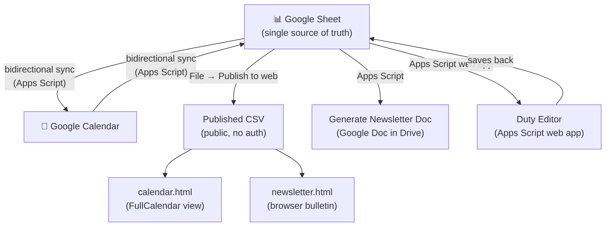

# SLV Rotary Management Prototype

A prototype management website for the **San Lorenzo Valley Rotary Club**, hosted on GitHub Pages.

**This is not a replacement for ClubRunner**. ClubRunner remains the club's official platform. This site is also not meant to replace the existing Google Calendar; it can optionally sync with it, but the Google Calendar stays the authoritative source.

Everything here is **driven by a single Google Sheet** that club leadership and committee chairs could manage. The website reads from that sheet automatically — no one needs to touch the website itself after initial setup.

The goal is to reduce copy-paste email work in three areas:

- **Calendar sync** — keep the Google Calendar up to date from the sheet (and vice versa)
- **Newsletter** — auto-generate a bulletin from the same sheet, so there's much less manual copy-paste
- **Duty Editor** — a simple web form for assigning meeting roles (MC, Greeter, etc.) without touching the spreadsheet directly

---

## How the pieces fit together



**`newsletter.html` and Generate Newsletter Doc produce the same content** — one renders in the browser, the other creates a shareable Google Doc in Drive. Use whichever fits your workflow for a given week.

**`calendar.html` is included for reference/completeness.** It reads the same sheet data and shows events in a calendar grid. It is not meant to replace the Google Calendar — just a quick visual check that doesn't require a Google login.

---

## Repository layout

| Path | Purpose |
|---|---|
| `index.md` | Homepage |
| `calendar.html` | FullCalendar 6 view, reads Sheet CSV (reference only) |
| `newsletter.html` | Dynamic weekly bulletin, reads Sheet CSV |
| `speak.md` | Link to "offer to speak" Google Form |
| `request.md` | Link to "request a speaker" Google Form |
| `appscript/RotaryCalendarSync.gs` | All Apps Script logic (paste into Sheet) |
| `_config.yml` | Jekyll config |
| `Gemfile` | GitHub Pages gem pin |

---

## Initial setup

### 1. Google Sheet

1. Create a new Google Sheet named **Rotary Events** (or similar).
2. Open **Extensions → Apps Script** and paste the entire contents of `appscript/RotaryCalendarSync.gs`.
3. From the **🔄 Rotary Sync** menu that appears, run **Setup / Reset Sheet Headers**. This creates the 30-column header row, formatting, dropdowns, and hidden columns.
4. Update `CALENDAR_ID` at the top of the script to your Google Calendar's ID (find it in Calendar Settings → Integrate calendar).
5. Publish the Sheet: **File → Share → Publish to web → Sheet: Events, Format: CSV → Publish**. Copy the URL.
6. Paste that URL into `calendar.html` and `newsletter.html` where `CSV_URL` is defined.

### 2. Install the edit trigger (run once)

In the sheet menu: **🔄 Rotary Sync → Install Edit Trigger**. This lets row colors update automatically when you change event type or cancellation status.

### 3. Members tab (for Duty Editor)

Run **🔄 Rotary Sync → Setup Members Tab**. Replace the sample names with your actual club members. These names appear as dropdown options in the Duty Editor.

### 4. Duty Editor web app

1. In the Apps Script editor: **Deploy → New deployment → Type: Web app**.
2. Set **Execute as: Me** and **Who has access: Anyone** (or limit to your org).
3. Click Deploy and copy the URL. Share it with whoever assigns meeting duties.
4. Once deployed, **🔄 Rotary Sync → Open Duty Editor** will open it directly from the sheet.

---

## Apps Script menu reference

| Menu item | What it does |
|---|---|
| ⬇️ Pull from Calendar → Sheet | Imports the next 180 days of Google Calendar events into the Sheet |
| ⬆️ Push Sheet → Calendar | Pushes Sheet rows to Google Calendar; skips rows whose hash hasn't changed |
| 📰 Generate Newsletter Doc | Creates a formatted Google Doc newsletter in your Drive's "Rotary" folder (same content as newsletter.html) |
| 🖼️ Sync Photos → URL Columns | Extracts URLs from photo cells (see [Photos](#photos)) |
| 📝 Open Duty Editor | Opens the deployed web app for assigning meeting duties |
| 👥 Setup Members Tab | Creates or resets the Members tab used by the Duty Editor |
| 📋 Setup / Reset Sheet Headers | Re-applies headers, formatting, dropdowns, and column widths |
| ⚡ Install Edit Trigger | Installs the onEdit trigger for automatic row coloring (run once) |

---

## Photos

The newsletter can display up to two photos per event: **Speaker Top Photo** (above the narrative) and **Speaker Bottom Photo** (below it). There are three ways to provide a photo:

### Option A — Plain URL (simplest)

Paste any `https://...` image URL directly into the Photo Top or Photo Bottom cell (columns P/Q). The newsletter picks it up from the CSV immediately — no sync needed.

For images stored in Google Drive, use this URL pattern (set sharing to "Anyone with the link can view"):
```
https://drive.google.com/uc?export=view&id=FILE_ID
```

### Option B — `=IMAGE("url")` formula

Type `=IMAGE("https://...")` into the cell. Run **🖼️ Sync Photos → URL Columns** to extract the URL into the hidden companion columns (AC/AD). The newsletter then displays the image.

### Option C — Embedded image (drag-drop or paste)

Insert an image directly into the cell via **Insert → Image → Image in cell**. Then:

1. Enable the **Advanced Google Sheets Service** (required once): in the Apps Script editor click **+** next to Services → find **Google Sheets API** → Add.
2. Run **🖼️ Sync Photos → URL Columns** from the sheet menu.

The sync reads the image cell using the Sheets API, writes the extracted URL to the hidden companion column, and leaves your image cell exactly as it was.

**How the fallback works:** The newsletter first checks the photo cell (col P/Q) for a plain URL. If the cell is blank in the CSV (which happens with embedded images and `=IMAGE()` formulas), it falls back to the hidden URL column (col AC/AD) that was written by the sync.

> **Note:** Embedded images may not always yield a publicly accessible URL depending on your Google Workspace settings. If the newsletter image doesn't load after syncing, use Option A instead.

---

## Column schema (Google Sheet)

| # | Column | Notes |
|---|---|---|
| A (1) | Event ID | Google Calendar event ID — hidden, do not edit |
| B (2) | Event Type | Dropdown: Meeting, Board Meeting, Social, Service, Committee, Other |
| C (3) | Cancelled | Checkbox — greys the row and strikes through the calendar entry |
| D (4) | Day | Auto-computed formula — "Tue, Sep W3" style label |
| E (5) | Date | YYYY-MM-DD |
| F (6) | Time | H:MM AM/PM |
| G (7) | Duration (min) | Defaults to 60 |
| H (8) | Location | Full venue address for Google Maps links |
| I (9) | Google Meet Link | Join URL shown in newsletter and calendar |
| J (10) | Speaker(s) Organizer | Who is managing / booking this speaker |
| K (11) | Opening Speaker | Invocation / opening speaker |
| L (12) | Main Speaker | Program speaker |
| M (13) | Main Topic | Program title |
| N (14) | Speaker URL | Optional link for speaker bio or topic reference |
| O (15) | Summary | Narrative paragraph — used in newsletter and as calendar event body |
| P (16) | Speaker Top Photo | URL **or** embedded image — displayed above narrative |
| Q (17) | Speaker Bottom Photo | URL **or** embedded image — displayed below narrative |
| R (18) | MC | Meeting MC if not the president |
| S (19) | Setup/Teardown | |
| T (20) | AV/Zoom | |
| U (21) | Greeter | |
| V (22) | 4-Way-Test | |
| W (23) | Thought | |
| X (24) | Detective | |
| Y (25) | Bag Person | |
| Z (26) | Comments | Internal notes — not synced to Calendar |
| AA (27) | Sync Status | Written by push/pull/duty operations — do not edit |
| AB (28) | Hash | Change-detection hash — hidden, do not edit |
| AC (29) | Photo Top URL | Auto-populated by Sync Photos — hidden, do not edit |
| AD (30) | Photo Bottom URL | Auto-populated by Sync Photos — hidden, do not edit |

---

## Local development

```bash
bundle install
bundle exec jekyll serve
# → http://localhost:4000
```

Requires Ruby and Bundler. The site uses the `github-pages` gem to match the production build exactly.

The calendar and newsletter pages fetch live data from the published Google Sheet CSV at runtime, so they work locally as long as the sheet is published.

---

## Tech stack

| Layer | Choice |
|---|---|
| Static site | Jekyll via `github-pages ~> 232` gem |
| Theme | Minima 2.5.1 (classic skin) |
| Hosting | GitHub Pages |
| Dynamic data | Google Sheets published CSV (no auth required) |
| Calendar widget | FullCalendar 6.x (jsDelivr CDN) |
| Forms | Google Forms (linked, not embedded) |
| Newsletter/duty logic | Vanilla JS + Apps Script web app |

No npm, no build pipeline, no bundlers — the site deploys cleanly via GitHub Pages on every push to `main`.
