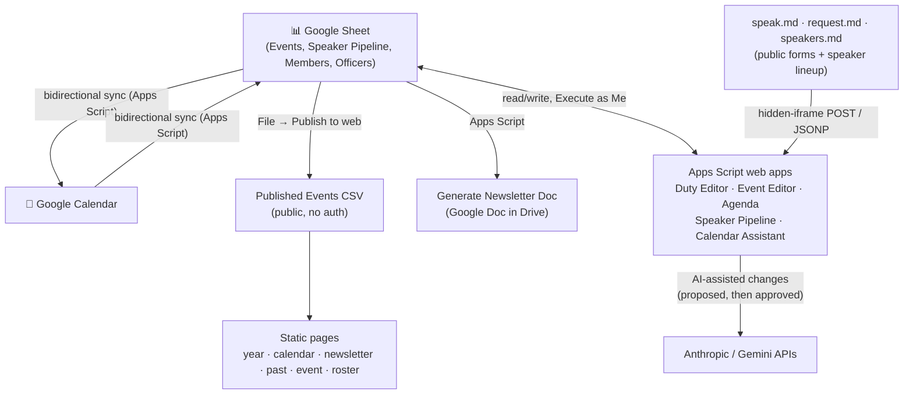

# SLV Rotary Management Prototype

A prototype management website for the **San Lorenzo Valley Rotary Club**, hosted on GitHub Pages.

**This is not a replacement for ClubRunner**. ClubRunner remains the club's official platform. This site is also not meant to replace the existing Google Calendar; it can optionally sync with it, but the Google Calendar stays the authoritative source.

Everything here is **driven by a single Google Sheet** that club leadership and committee chairs could manage. The website reads from that sheet automatically — no one needs to touch the website itself after initial setup.

> **Deeper references:** [CLAUDE.md](CLAUDE.md) documents every page/tool's
> behavior, the full sheet column schema, and event types. [APPSCRIPT.md](APPSCRIPT.md)
> documents the Apps Script side specifically — system architecture, every
> web-app route, the full RPC surface, and how auth actually works. This
> README stays at the "what is this / how do I set it up" level.

What started as calendar sync + a newsletter generator has grown into a
small toolkit, all still driven by that one Sheet:

- **Calendar sync** — keep Google Calendar up to date from the sheet (and vice versa)
- **Newsletter** — auto-generate a bulletin (browser page or Google Doc) from the same sheet
- **Duty Editor** — assign meeting/assembly/social roles (MC, Greeter, etc.) without touching the spreadsheet
- **Event Editor** — members create/edit socials, service projects, fundraisers, and announcements
- **Speaker Pipeline** — track prospective speakers from offer/request through scheduling (Kanban board + sortable table views)
- **Meeting Agenda Generator** — printable 15-row agenda + duty table for the next meeting
- **Duty Sign-Up Sheet** — printable paper roster for the next 4/8/12 weeks, for clipboard sign-ups
- **Calendar Assistant** — an AI chat interface (Claude or Gemini) that proposes calendar changes for approval
- **Event Detail pages** — shareable, no-login links for a single event
- **Public speaker page** (`/speakers/`) — lets anyone browse and show support for upcoming speakers

---

## How the pieces fit together


```mermaid
graph TD
    Sheet["📊 Google Sheet\n(Events, Speaker Pipeline, Members, Officers)"]
    Cal["📅 Google Calendar"]
    CSV["Published Events CSV\n(public, no auth)"]
    StaticPages["Static pages\nyear · calendar · newsletter · past · event · roster"]
    NewsDoc["Generate Newsletter Doc\n(Google Doc in Drive)"]
    Apps["Apps Script web apps\nDuty Editor · Event Editor · Agenda\nSpeaker Pipeline · Calendar Assistant"]
    AI["Anthropic / Gemini APIs"]
    Forms["speak.md · request.md · speakers.md\n(public forms + speaker lineup)"]

    Sheet -- "bidirectional sync (Apps Script)" --> Cal
    Cal -- "bidirectional sync (Apps Script)" --> Sheet
    Sheet -- "File → Publish to web" --> CSV
    CSV --> StaticPages
    Sheet -- "Apps Script" --> NewsDoc
    Sheet <-- "read/write, Execute as Me" --> Apps
    Apps -- "AI-assisted changes\n(proposed, then approved)" --> AI
    Forms -- "hidden-iframe POST / JSONP" --> Apps
```

**`newsletter.html` and Generate Newsletter Doc produce the same content** — one renders in the browser, the other creates a shareable Google Doc in Drive. Use whichever fits your workflow for a given week.

**The static pages never touch the Sheet directly** — they read the published Events-tab CSV client-side, so they work with no Google login and no Apps Script involved. Only the Apps Script web apps read/write the Sheet directly, and only they can see the **Speaker Pipeline**, **Members**, and **Officers** tabs, since only the **Events** tab is published as CSV.

For the full picture — every `?app=` route, the complete RPC surface, and
(importantly) how auth actually works across the two deployments — see
**[APPSCRIPT.md](APPSCRIPT.md)**.

---

## Repository layout

| Path | Purpose |
|---|---|
| `index.md` | Homepage |
| `calendar.html` | FullCalendar 6 view + tool cards, reads Sheet CSV |
| `year.html` | Mini year-at-a-glance grid (July–June), reads Sheet CSV |
| `newsletter.html` | Dynamic weekly bulletin, reads Sheet CSV |
| `past.html` | Past-meetings archive |
| `event.html` | Shareable, no-login single-event detail page (`/event/`) |
| `roster.html` | Printable duty sign-up sheet, next 4/8/12 weeks (`/roster/`) |
| `duty.md` | Redirect to the Duty Editor web app |
| `pipeline.md` | Tools page listing every member-facing web app (`/pipeline/`) |
| `speak.md` | In-page "offer to speak" form, POSTs to the Apps Script backend |
| `request.md` | In-page "request a speaker" form, POSTs to the Apps Script backend |
| `speakers.md` | Public speaker lineup (`/speakers/`) — JSONP read, ♡/note POST |
| `assets/js/rotary-common.js` | Shared CSV-fetch/parse/render helpers used by most static pages |
| `appscript/RotaryCalendarSync.gs` | All Apps Script logic — the one file behind every `?app=` web app |
| `_config.yml` | Jekyll config, incl. `apps_script_url` |
| `Gemfile` | GitHub Pages gem pin |
| `CLAUDE.md` | Product/behavior reference: every tool, the sheet column schema, event types |
| `APPSCRIPT.md` | Apps Script architecture: system diagram, routes, RPC surface, auth model |

---

## Initial setup

### 1. Google Sheet

1. Create a new Google Sheet named **Rotary Events** (or similar).
2. Open **Extensions → Apps Script** and paste the entire contents of `appscript/RotaryCalendarSync.gs`.
3. From the **🔄 Rotary Sync** menu that appears, run **Setup / Reset Sheet Headers**. This creates the Events tab's header row, formatting, dropdowns, and hidden columns — see [CLAUDE.md](CLAUDE.md#google-sheet) for the full column-by-column schema.
4. Update `CALENDAR_ID` at the top of the script to your Google Calendar's ID (find it in Calendar Settings → Integrate calendar).
5. Publish the Sheet: **File → Share → Publish to web → Sheet: Events, Format: CSV → Publish**. Copy the URL.
6. Paste that URL into `assets/js/rotary-common.js`, `calendar.html`, and `year.html` where `CSV_URL` is defined (these three files each hold their own copy — see [CLAUDE.md](CLAUDE.md#google-sheet)).

### 2. Other tabs

- **Install the edit trigger** (run once): **🔄 Rotary Sync → Install Edit Trigger**, so row colors update automatically when you change event type or cancellation status.
- **Members tab**: run **🔄 Rotary Sync → Setup Members Tab**, then replace the sample names with your actual club members — these feed every member-name dropdown across all the web apps.
- **Speaker Pipeline tab** (only if you'll use the Speaker Pipeline / speak.md / request.md): run **🔄 Rotary Sync → Setup Speaker Pipeline Tab**.
- **Officers tab** (only for the Meeting Agenda Generator): create it by hand — a plain two-column `Role | Name` sheet, no menu item creates this one. See [CLAUDE.md](CLAUDE.md#agenda-generator).

### 3. Script Properties (optional, per feature)

**Apps Script → Project Settings → Script Properties.** None of these are required to get calendar sync/newsletter/Duty Editor running; add only the ones for features you'll use:

| Property | Enables |
|---|---|
| `KANBAN_PASSWORD` | Login for the Event Editor and all three Speaker Pipeline views |
| `NOTIFY_EMAILS` | Email notifications on new speaker-form submissions |
| `ANTHROPIC_API_KEY` | Calendar Assistant, when set to use Claude |
| `GEMINI_API_KEY` | Calendar Assistant's default provider; the (off-by-default) Pipeline AI command line |

### 4. Deploy the web app(s)

This single script backs **every** `?app=` tool (Duty Editor, Event Editor,
Agenda Generator, all three Speaker Pipeline views) through one deployment,
plus a second, separately-access-controlled deployment for the Calendar
Assistant. See [APPSCRIPT.md](APPSCRIPT.md#2-deployments) for exactly how
the routing and access control work.

1. In the Apps Script editor: **Deploy → New deployment → Type: Web app**.
2. Set **Execute as: Me** and **Who has access: Anyone** (or limit to your org). Deploy, and copy the URL — this covers the Duty Editor plus every `?app=` tool except the Calendar Assistant.
3. Paste that URL into **`_config.yml` → `apps_script_url`**. Every page that links to a web app (`duty.md`, `pipeline.md`, the tool cards on `calendar.html`, `speak.md`/`request.md`/`speakers.md`) reads it from there.
4. Once deployed, **🔄 Rotary Sync → Open Duty Editor** (and **→ Open Speaker Pipeline**) will open the app directly from the sheet.
5. **Optional — Calendar Assistant:** a *second* Web app deployment from the same project, **Execute as: Me**, **Who has access: Only myself**. Reached at `…/exec?app=assistant`; there's no tool-card link to it since it's Eric-only by design.

---

## Apps Script menu reference

| Menu item | What it does |
|---|---|
| ⬇️ Pull from Calendar → Sheet | Imports the next 180 days of Google Calendar events into the Sheet |
| ⬆️ Push Sheet → Calendar | Pushes Sheet rows to Google Calendar; skips rows whose hash hasn't changed |
| 📰 Generate Newsletter Doc | Creates a formatted Google Doc newsletter in your Drive's "Rotary" folder (same content as newsletter.html) |
| 🖼️ Sync Photos → URL Columns | Extracts URLs from photo cells (see [Photos](#photos)) |
| 📝 Open Duty Editor | Opens the deployed web app for assigning duties |
| 🎤 Open Speaker Pipeline | Opens the Speaker Pipeline web app |
| 👥 Setup Members Tab | Creates or resets the Members tab used by every web app's name dropdowns |
| 📋 Setup / Reset Sheet Headers | Re-applies Events-tab headers, formatting, dropdowns, and column widths |
| 🎤 Setup Speaker Pipeline Tab | Creates or resets the Speaker Pipeline tab |
| 🔧 Migrate Confirmed → In Progress | One-time cleanup for a renamed pipeline status |
| 🧹 Purge Old Rate Counters | Clears stale rate-limit Script Properties left by the public form endpoints |
| ✉️ Authorize Email (run once) | Forces the Gmail-send consent prompt so notification emails can send |
| ⚡ Install Edit Trigger | Installs the onEdit trigger for automatic row coloring (run once) |

See [APPSCRIPT.md](APPSCRIPT.md#9-menu-triggered--trigger-driven-functions) for the underlying function name behind each item.

---

## Photos

The newsletter can display up to two photos per event: **Speaker Top Photo** (above the narrative) and **Speaker Bottom Photo** (below it). There are three ways to provide a photo:

### Option A — Plain URL (simplest)

Paste any `https://...` image URL directly into the Photo Top or Photo Bottom cell (columns P/Q). The newsletter picks it up from the CSV immediately — no sync needed.

For images stored in Google Drive, use this URL pattern (set sharing to "Anyone with the link can view"):
```
https://drive.google.com/uc?export=view&id=FILE_ID
```

### Option B — `=IMAGE("url")` formula

Type `=IMAGE("https://...")` into the cell. Run **🖼️ Sync Photos → URL Columns** to extract the URL into the hidden companion columns (AC/AD). The newsletter then displays the image.

### Option C — Embedded image (drag-drop or paste)

Insert an image directly into the cell via **Insert → Image → Image in cell**. Then:

1. Enable the **Advanced Google Sheets Service** (required once): in the Apps Script editor click **+** next to Services → find **Google Sheets API** → Add.
2. Run **🖼️ Sync Photos → URL Columns** from the sheet menu.

The sync reads the image cell using the Sheets API, writes the extracted URL to the hidden companion column, and leaves your image cell exactly as it was.

**How the fallback works:** The newsletter first checks the photo cell (col P/Q) for a plain URL. If the cell is blank in the CSV (which happens with embedded images and `=IMAGE()` formulas), it falls back to the hidden URL column (col AC/AD) that was written by the sync.

> **Note:** Embedded images may not always yield a publicly accessible URL depending on your Google Workspace settings. If the newsletter image doesn't load after syncing, use Option A instead.

---

## Column schema (Google Sheet)

The Events tab's full column-by-column schema (currently 35 columns, A
through AI) lives in **[CLAUDE.md → Google Sheet](CLAUDE.md#google-sheet)** —
kept there rather than duplicated here so it can't drift out of sync with
`appscript/RotaryCalendarSync.gs`'s own `COL` map the way an earlier, shorter
version of this table did.

---

## Moving to a new Google account

Everything dynamic is tied to **one Google account**: the Sheet, its bound Apps
Script project, the web-app deployments, the published CSV, and the Drive
"Rotary" folder of photos/newsletters. The GitHub Pages repo itself is **not**
tied to the account — only a few config URLs change. Work through this checklist
when handing the project to a different Gmail/Workspace account.

> **Recommended approach: copy + reconfigure.** From the new account, open the
> Sheet and do **File → Make a copy**. A copy duplicates the Sheet *and* its
> bound Apps Script code, but **does not copy** Script Properties, installable
> triggers, or web-app deployments — so those must be redone (steps 2–6 below).
> Transferring ownership instead keeps the same deployments but still forces
> re-authorization; copying is the cleaner, more predictable path for a prototype.

1. **Copy the Sheet** into the new account (File → Make a copy). This brings the
   `Events`, `Speaker Pipeline`, `Members`, and `Officers` tabs and the full
   `.gs` code. Delete any old `Backup …` tabs you don't need.

2. **Re-enter Script Properties** — Apps Script editor → **Project Settings →
   Script Properties**. These are *not* copied and the apps silently misbehave
   without them:
   | Property | Used by |
   |---|---|
   | `KANBAN_PASSWORD` | Login gate for the Speaker Pipeline apps **and** the Event Editor |
   | `NOTIFY_EMAILS` | Comma/space-separated recipients for new speaker-form submissions |
   | `ANTHROPIC_API_KEY` | Calendar Assistant (Claude) |
   | `GEMINI_API_KEY` | Calendar Assistant default + pipeline AI command line (optional) |

   (The auto-created `sub_YYYY-MM-DD` rate-limit counters can be ignored; run
   **🧹 Purge Old Rate Counters** later to tidy them.)

3. **Point at the new calendar** — set `CALENDAR_ID` at the top of the `.gs` to
   the new account's calendar ID (Calendar Settings → Integrate calendar), or
   share the existing calendar to the new account with "Make changes to events"
   and use that ID.

4. **Authorize scopes** — run any **🔄 Rotary Sync** menu item once and accept
   the OAuth prompt. Then run **✉️ Authorize Email (run once)** specifically, so
   `MailApp` is granted the `script.send_mail` scope — otherwise the speaker-form
   confirmation/notification emails fail silently. Also run **⚡ Install Edit
   Trigger** to restore automatic row coloring.

5. **Re-deploy the web app(s)** under the new account — Deploy → New deployment →
   Web app:
   - **Duty Editor / pipeline / Event Editor**: Execute as **Me**, access
     **Anyone**. Copy the new `…/exec` URL.
   - **Calendar Assistant** (optional): a second Web app deployment, Execute as
     **Me**, access **Only myself** (reached via `?app=assistant`).

   The new `…/exec` URL is **different** from the old one. Update it in
   **`_config.yml` → `apps_script_url`** — that one value feeds the speaker
   forms (`request.md` / `speak.md`), the public `/speakers/` page, and all the
   pipeline/editor cross-links.

6. **Re-publish the CSV** — File → Share → Publish to web → **Events** sheet →
   **CSV** → Publish. The new published URL (and the tab `gid`) differ. Update it
   in every place it's hardcoded:
   - `assets/js/rotary-common.js` (the shared fetch used by `newsletter.html`)
   - `calendar.html`
   - `year.html`
   - `CLAUDE.md` (documentation reference)

7. **Drive photos & newsletters** — uploaded speaker/event photos and generated
   newsletter Docs live in a Drive **Rotary** (and **Rotary/Photos**) folder owned
   by the *old* account. Existing `drive.google.com/...` image URLs keep working
   only while those files stay shared "Anyone with the link". Before retiring the
   old account, move that folder to the new account (or re-upload key images and
   re-run **🖼️ Sync Photos**), or the newsletter/pipeline thumbnails will break.

8. **Commit & push** the edited `_config.yml`, `assets/js/rotary-common.js`,
   `calendar.html`, and `year.html`. GitHub Pages redeploys on push; the
   `rotary.porttack.com` domain and the in-site links to it are unchanged.

After this, submit one test speaker request to confirm the row lands in the new
**Speaker Pipeline** tab and both emails arrive.

---

## Local development

```bash
bundle install
bundle exec jekyll serve
# → http://localhost:4000
```

Requires Ruby and Bundler. The site uses the `github-pages` gem to match the production build exactly.

The calendar and newsletter pages fetch live data from the published Google Sheet CSV at runtime, so they work locally as long as the sheet is published.

---

## Tech stack

| Layer | Choice |
|---|---|
| Static site | Jekyll via `github-pages ~> 232` gem |
| Theme | Minima 2.5.1 (classic skin) |
| Hosting | GitHub Pages |
| Dynamic data | Google Sheets published CSV (no auth required) |
| Calendar widget | FullCalendar 6.x (jsDelivr CDN) |
| Forms | In-page HTML forms POSTing to the Apps Script backend (hidden-iframe submit, no Google Forms) |
| Web apps / logic | Vanilla JS + a single Apps Script project (`appscript/RotaryCalendarSync.gs`), deployed twice — see [APPSCRIPT.md](APPSCRIPT.md) |
| AI (optional) | Anthropic Claude and/or Google Gemini — Calendar Assistant and the (off-by-default) Pipeline AI command line |

No npm, no build pipeline, no bundlers — the site deploys cleanly via GitHub Pages on every push to `main`.
